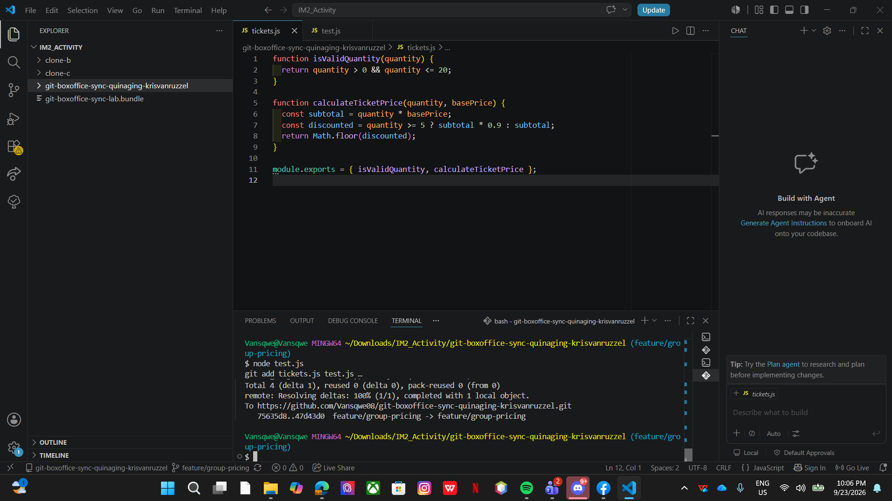
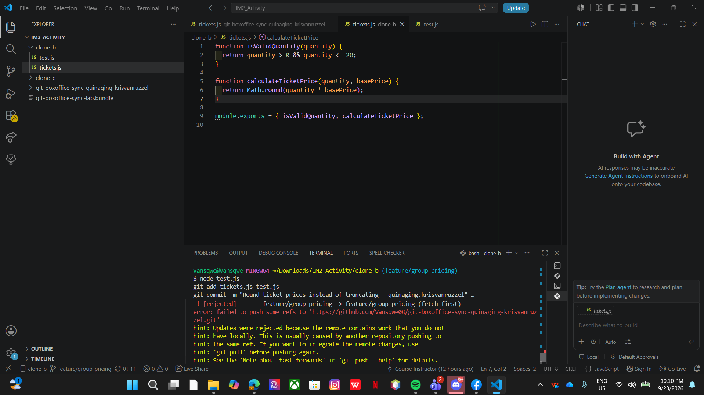
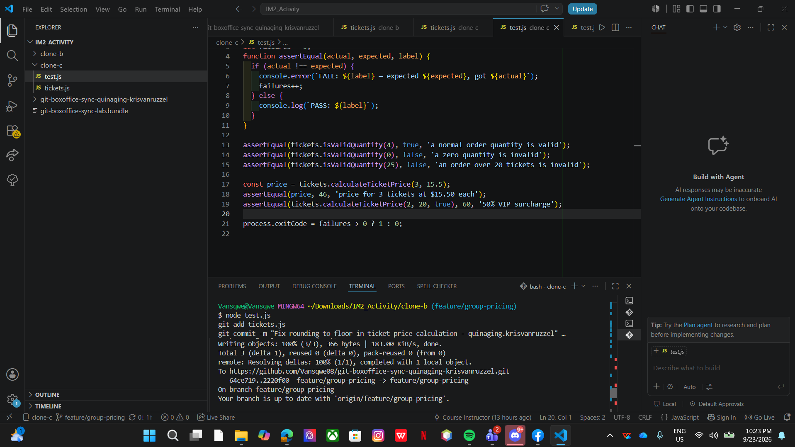
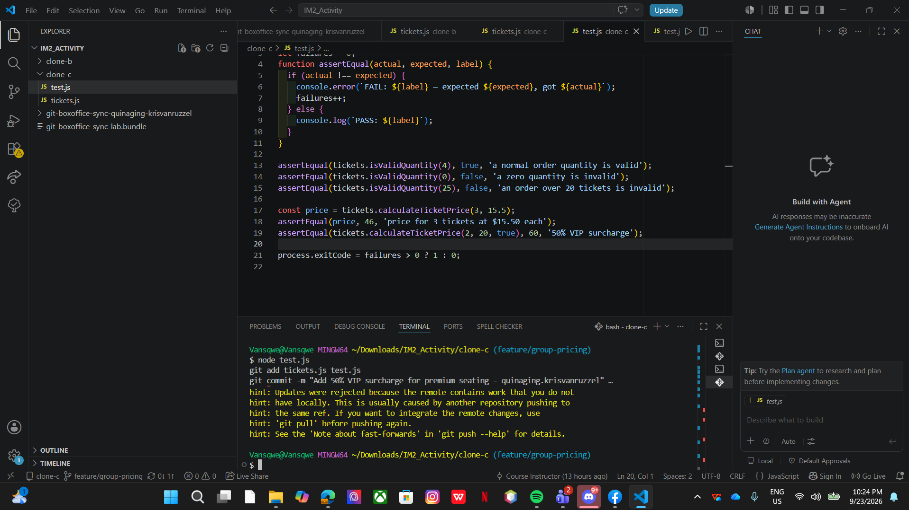
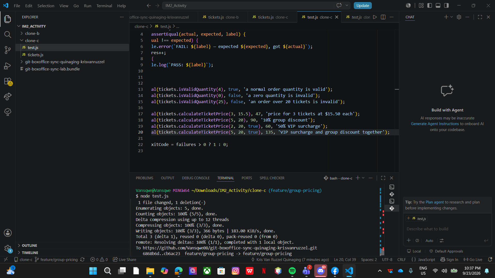
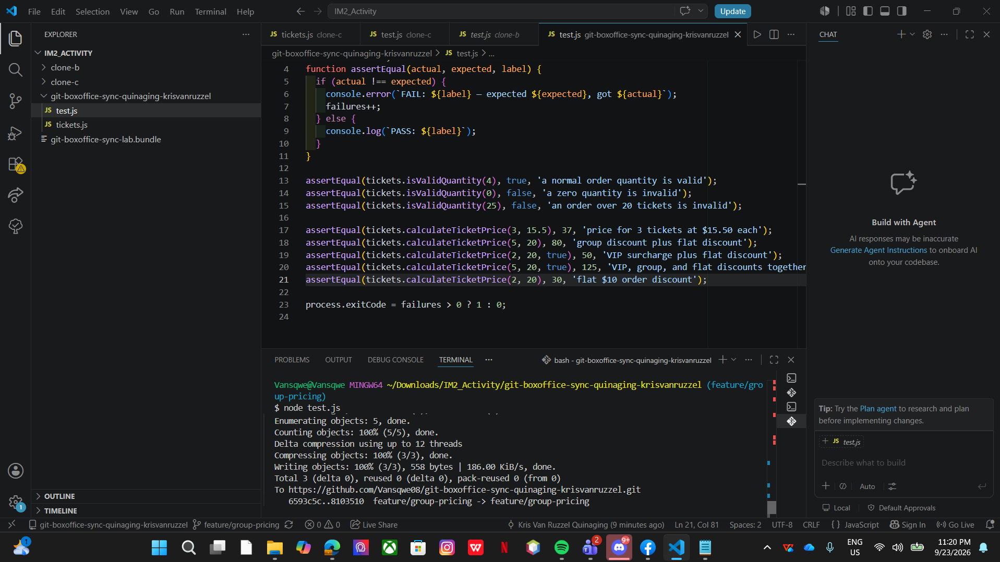
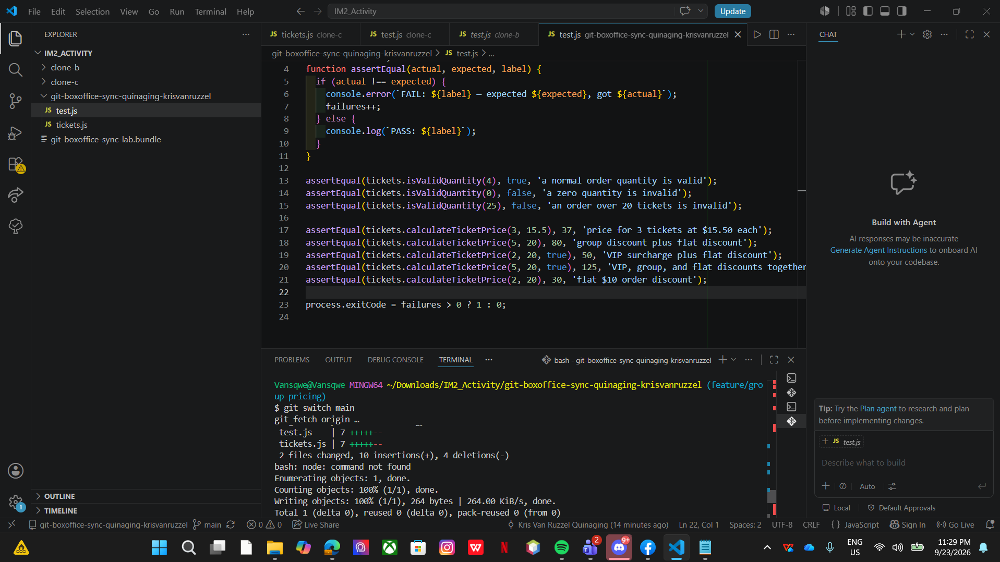

# Git Box Office Sync Lab — Workflow

**Name:** Krisvanruzzel Quinaging
**GitHub:** Vansqwe08
**Repository:** `git-boxoffice-sync-quinaging-krisvanruzzel`

## Final `calculateTicketPrice` Function

The final `calculateTicketPrice` function contains all four contributors' changes.

* **Group discount — Contributor A:** Orders with 5 or more tickets receive a 10% group discount.
* **Rounding — Contributor B:** The calculated ticket price is rounded instead of being truncated.
* **VIP surcharge — Contributor C:** Premium or VIP seating adds a 50% surcharge.
* **Flat $10 discount — Contributor A in Task 6:** A flat $10 discount is applied to the order.

The final function combines these changes into one working pricing calculation, and the tests were used to confirm that the behaviors work together.

## Task 3 vs. Task 5 Conflicts

Task 3 involved two lines of work: the group discount from Contributor A and the rounding change from Contributor B. The conflict had to be resolved so both changes remained in the same pricing function.

Task 5 was more difficult because a third line of work was introduced by Contributor C. Clone C started from the original state and then had to reconcile its VIP surcharge with the already-merged group discount and rounding changes. This meant there were more changes to compare and more interactions to consider when resolving the conflict.

## Why Task 6 Affected Other Tests

The flat $10 discount was added to shared pricing logic. Although it was intended as one isolated change, the group-discount and VIP tests also use the same `calculateTicketPrice` function. Therefore, changing the final price in that shared function also changed the expected results of those tests.

This shows that changes are not always completely isolated when multiple behaviors depend on the same shared function. A small pricing change can affect several features and their tests because they use the same calculation.

## Process Change That Could Prevent the Rejected Pushes

If this were a real team of three, the team should synchronize with the shared remote branch before starting work. Contributors could fetch and update their local branch before making changes, and the team could coordinate who is working on the same feature before pushing.

This would reduce situations where multiple contributors independently modify the same code without knowing about each other's changes.

## Screenshot Evidence

### Task 1

### Task 2

### Task 3

### Task 4

### Task 5

### Task 6

### Task 7

